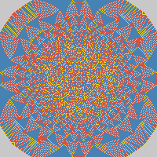

# Лабораторная работа 3

## API

### Input file
```
100	100
100	100	100000
```

### Usage
```
  -l, --length <value>  Sandpile height (uint16_t)
  -w, --width  <value>  Sandpile width (uint16_t)
  -i, --input  <file>   Input TSV file
  -h, --help            Show this help message
```

### Sandpile class
```cpp
    Sandpile(int width, int height);
    void loadFromFile( std::string );
    void run( uint64_t maxIterations = 100000, uint64_t freq = 0, std::string inputFilename = "" );
    std::vector < std::vector < uint64_t > > getField();
```

## Пример результата

