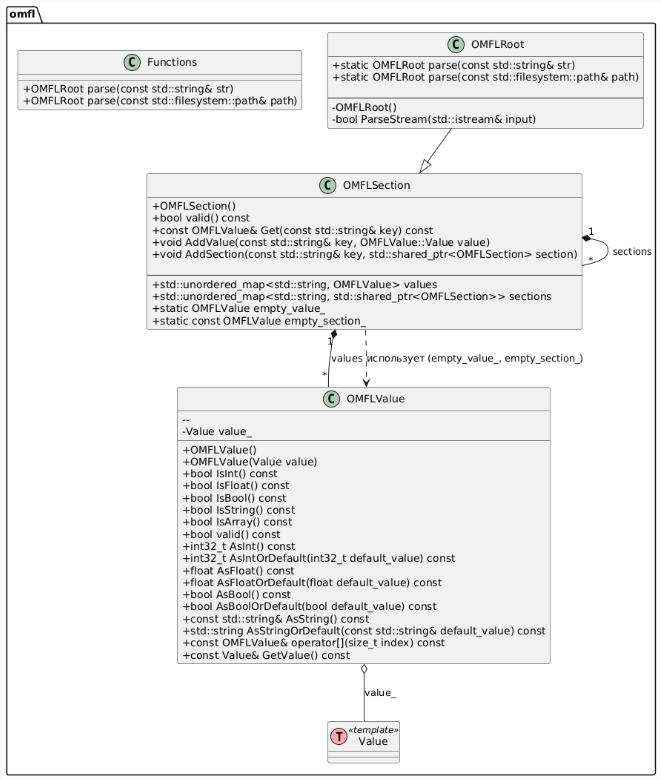

# Лабораторная работа 6

OneMoreFunnyLanguage format
OMFL - это формат для хранения конфигурационных файлов. По своей природе он похож на ini, но является более гибким. Основной его целью является возможность получать из конфига значение по определенному ключу и логическое разделение на секции и подсекции.

#### UML-диаграмма классов
