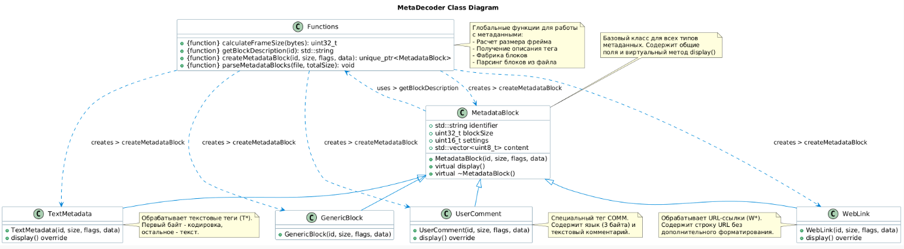

# Лабораторная работа 7

#### MetaDecoder — класс для чтения ID3v2-тегов в MP3 с гибкой архитектурой (базовый класс + специализированные подклассы).

## Тесты проверяют:
 - Парсинг бинарных данных
 - Фабрику тегов (TextMetadata, WebLink и др.)
 - Обработку ошибок (битые заголовки, неполные данные)
 - Интеграцию с файлами (через TempFileFixture)

## UML-диаграмма классов

