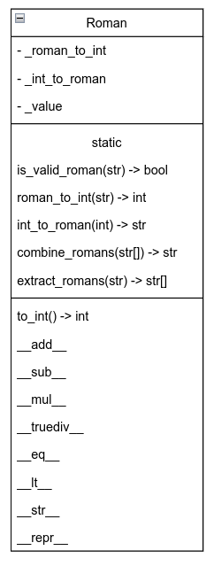

# python-labs

## Задача 
### Создать класс Roman (РимскоеЧисло), представляющий римское число и поддерживающий операции +, -, *, /.
#### При реализации класса следуйте рекомендациям:
- операции +, -, *, / реализуйте как специальные методы (_add __ и др.);
- методы преобразования имеет смысл реализовать как статические методы, позволяя не создавать экземпляр объекта в случае, если необходимо выполнить только преобразования чисел.

  
## API
```python
class Roman:
    """Класс для представления римского числа с поддержкой арифметических операций и сравнения."""

    def __init__(self, value: str) -> None;

    @staticmethod
    def is_valid_roman(roman: str) -> bool;
        """Проверяет, является ли строка корректным римским числом."""

    @staticmethod
    def roman_to_int(roman: str) -> int;
        """Преобразует римское число в десятичное."""

    @staticmethod
    def int_to_roman(number: int) -> str;
        """Преобразует десятичное число в римское."""

    @staticmethod
    def combine_romans(roman_list: List[str]) -> str;
        """Складывает несколько римских чисел и возвращает результат в римской системе."""

    @staticmethod
    def extract_romans(text: str) -> List["Roman"]:
        """Извлекает римские числа из текста и возвращает список объектов Roman."""

    def to_int(self) -> int:
        """Возвращает арабское представление римского числа"""
```


