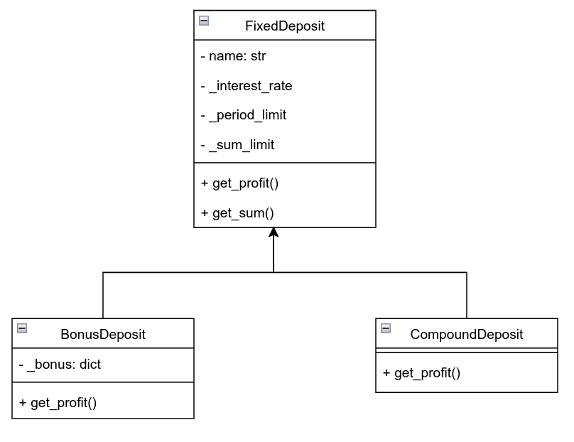

# python-labs

## Задача 
### Расчет предпочтительного банковского вклада
#### Банк предлагает ряд вкладов для физических лиц:
- Срочный вклад: расчет прибыли осуществляется по формуле простых процентов;
- Бонусный вклад: бонус начисляется в конце периода как % от прибыли, если вклад больше определенной суммы;
- Вклад с капитализацией процентов.

## API
```python
class FixedDeposit:
    """Абстрактный класс - срочный вклад."""

    def __init__(self, name: str, interest_rate: float, period_limit: tuple[int, int], sum_limit: tuple[int, int]) -> None:
        """Инициализировать атрибуты класса."""

    def __str__(self) -> str:
        """Вернуть строкое представление депозита."""

    @property
    def currency(self) -> str:
        """Возвращает валюту депозита."""

    def _check_self(self) -> None:
        """Проверить, что данные депозита являются допустимыми."""

    def _check_user_params(self, initial_sum: float, period: int) -> None:
        """Проверить, что данные депозита соответствуют его ограничениям."""

    def get_profit(self, initial_sum: float, period: int) -> float:
        """Вернуть прибыль по вкладу клиента."""

    def get_sum(self, initial_sum: float, period: int) -> float:
        """Вернуть сумму вклада клиента после начисления прибыли."""


class BonusDeposit(FixedDeposit):
    """Срочный вклад с получением бонуса к концу срока вклада."""

    def __init__(self, name: str, interest_rate: float, period_limit: tuple[int, int], sum_limit: tuple[int, int], bonus: dict) -> None:
        """Инициализировать атрибуты класса."""

    def __str__(self) -> str:
        """Вернуть строкое представление депозита."""

    def _check_self(self) -> None:
        """Проверить, что данные депозита являются допустимыми."""

    def get_profit(self, initial_sum: float, period: int) -> float:
        """Вернуть прибыль по вкладу клиента с учетом бонуса."""


class CompoundDeposit(FixedDeposit):
    """Cрочный вклад c ежемесячной капитализацией процентов."""

    def __str__(self) -> str:
        """Вернуть строкое представление депозита."""

    def get_profit(self, initial_sum: float, period: int) -> float:
        """Вернуть прибыль по вкладу клиента."""

# Список имеющихся депозитов
deposits = []
```


