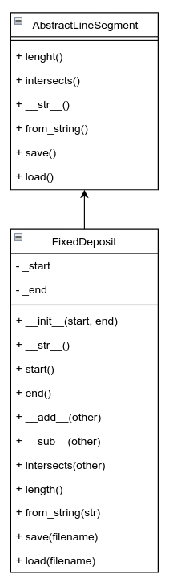

# python-labs

## Задача 
### LineSegment
#### LineSegment — это математический интервал, который определяется двумя точками (левая и правая границы). Например, отрезок [a, b], где a — это левая граница, а b — правая. Операции над такими отрезками включают:
- Сложение и вычитание отрезков.
- Проверку на пересечение.
- Вычисление длины отрезка.
- Преобразование отрезка из строки. 
- Дополнительно: сохранение и загрузка объекта в/из файла.

## API
```python
class AbstractLineSegment(ABC):
    @abstractmethod
    def length(self):
        """Метод для вычисления длины отрезка"""

    @abstractmethod
    def intersects(self, other):
        """Метод для проверки пересечения отрезков"""

    @abstractmethod
    def __str__(self):
        """Метод для строкового представления объекта"""

    @classmethod
    @abstractmethod
    def from_string(cls, str_value):
        """Метод для создания объекта на основе строки"""

    @abstractmethod
    def save(self, filename):
        """Метод для сохранения объекта в JSON"""

    @classmethod
    @abstractmethod
    def load(cls, filename):
        """Метод для загрузки объекта из JSON"""

class LineSegment(AbstractLineSegment):
    def __init__(self, start, end):

    def __str__(self):
        return f"[{start}, {end}]"

    def __add__(self, other):
        """Объединение двух отрезков"""

    def __sub__(self, other):
        """Вычитание отрезков"""

    def length(self):
        """Вычисление длины отрезка"""
```


