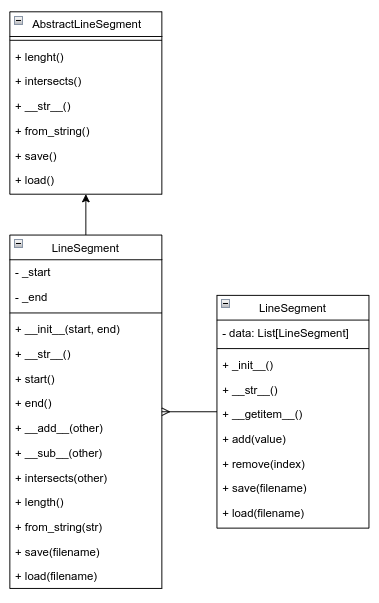

# python-labs

## Задача 
### LineSegmentCollection
#### Для класса-контейнера предусмотрите:
- специальные методы:
  - _init_(self, ..) - инициализация с необходимыми параметрами;
  - _str_(self) - представление объекта в удобном для человека виде;
  - _getitem_0 - индексация и срез для класса-контейнера.
- поля, методы, свойства:
  - поле _data - содержит набор данных;
  - метод add(self, value) - добавляет элемент value в контейнер;
  - метод remove(self, index) - удаляет элемент из контейнера по индексу index;
  - метод save(self, filename) - сохраняет объект в JSON-файл filename;
  - метод load(self, filename) - загружает объект из JSON-файла filename.

## API
```python
class LineSegmentCollection:
    def __str__(self):
        return f"LineSegmentCollection({', '.join(str(segment) for segment in self._data)})"

    def __getitem__(self, index):
        """Обработка индексации и срезов"""

    def add(self, value):
        """Добавление объекта LineSegment в коллекцию"""

    def remove(self, index):
        """Удаление объекта LineSegment по индексу"""

    def save(self, filename):
        """Сохранение коллекции объектов в JSON-файл"""

    @classmethod
    def load(cls, filename):
        """Загрузка коллекции объектов из JSON-файла"""
```


