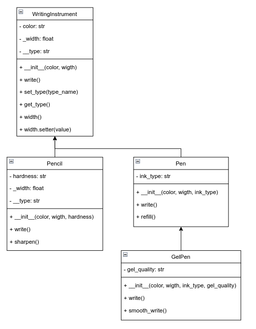

# python-labs

## Задача 
### Выстоить классы в иерархию

## API
```python
class WritingInstrument(ABC):
    def __init__(self, color: str, width: float):

    @abstractmethod
    def write(self):

    @width.setter
    def width(self, value):

    def set_type(self, type_name):
        """Устанавливаем тип принадлежности (для внутреннего использования)"""

    def get_type(self):
        """Получаем тип принадлежности"""

class Pencil(WritingInstrument):
    def __init__(self, color: str, width: float, hardness: str):

    def write(self):
        print(f"Карандаш пишет {self.color} цветом и жесткостью {self.hardness} с шириной {self.width} мм.")

    def sharpen(self):
        """Дополнительный метод для точения карандаша"""

class Pen(WritingInstrument):
    def __init__(self, color: str, width: float, ink_type: str):

    def write(self):
        print(f"Ручка пишет {self.color} чернилами и типом {self.ink_type} с шириной {self.width} мм.")

    def refill(self):
        """Метод для заправки ручки"""

class GelPen(Pen):
    def __init__(self, color: str, width: float, ink_type: str, gel_quality: str):

    def write(self):
        print(f"Гелевая ручка пишет {self.color} гелем с качеством {self.gel_quality} и шириной {self.width} мм.")

    def smooth_write(self):
        """Метод для плавного письма"""
```


